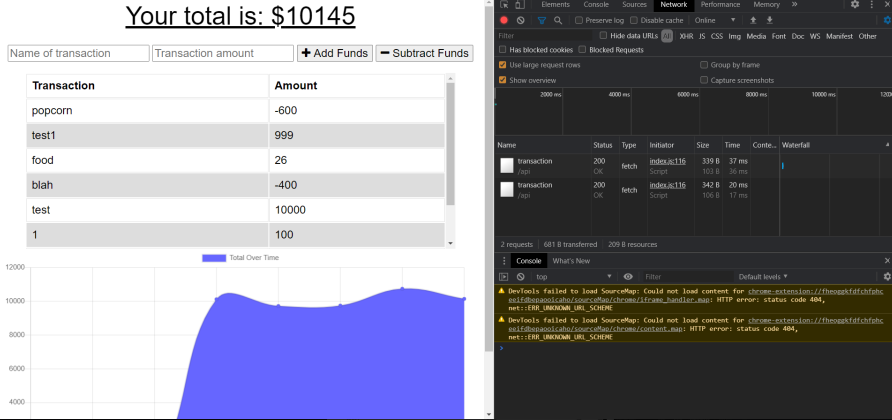
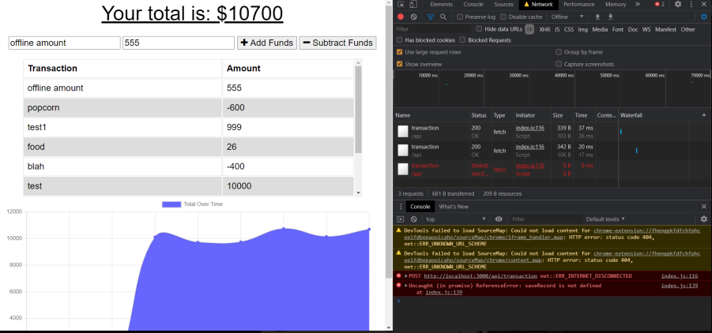

# PWA Budget Tracker
## Github Repository
https://github.com/josephmagdaleno/BudgetTracker
## Description
A budget tracker application to allow users online or offline access and functionality. The user will be able to add expenses to their budget with or without a connection to the internet. When entering transactions offline, they should populate the total when brought back online.
## Table of Contents
* [Installation](#installation)
* [Usage](#usage)
* [License](#license)
* [Contributing](#contributing)
* [Tests](#tests)
* [Questions](#questions)
## Installation
To install necessary dependencies, run the following command:
npm install
## Usage
While online

While offline

## License
This project is licensed under the None license.
## Deployed Application
https://sleepy-spire-25039.herokuapp.com/
## Tests
To run tests, run the following command:
npm test
## Questions
If you have any questions about the repo, contact josephmagdaleno at Joseph66magdaleno@yahoo.com.
